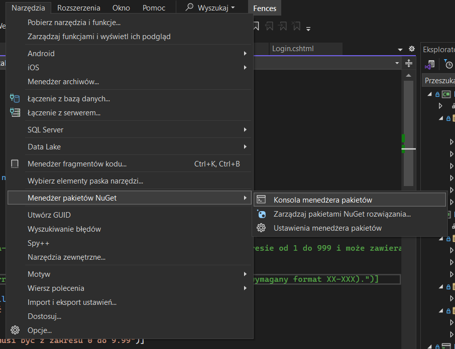
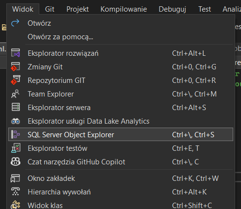
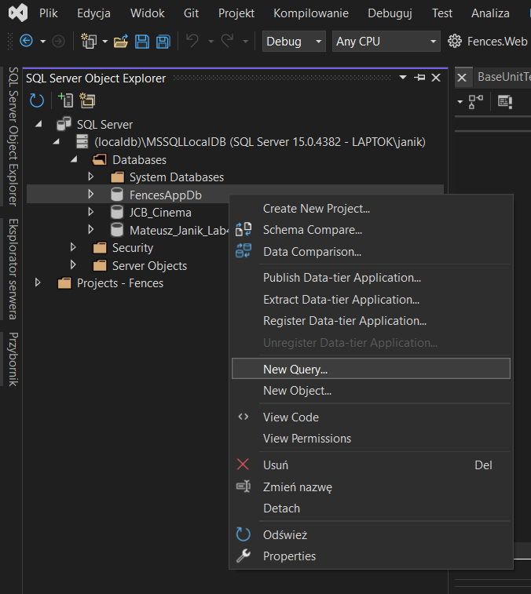
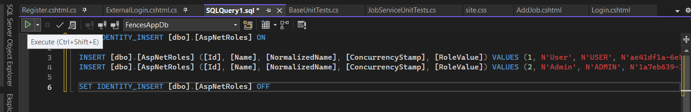
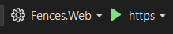

# Installation
Before starting the project, first you have to create a database.

Run the package manager console :



And type this comand :
```
update-database
```

Next you have to add roles to DataBase manually.
Open SQL Server Object Exploreer.



After unrolling all the strips, click the rigth mouse button on the data base named "FencesAppDb" and select option "New Query"



In new window paste this code and click "Exacute"

```
SET IDENTITY_INSERT [dbo].[AspNetRoles] ON

INSERT [dbo].[AspNetRoles] ([Id], [Name], [NormalizedName], [ConcurrencyStamp], [RoleValue]) VALUES (1, N'User', N'USER', N'ae41df1a-6e54-465fb52e-847fcc0029c7', 0)
INSERT [dbo].[AspNetRoles] ([Id], [Name], [NormalizedName], [ConcurrencyStamp], [RoleValue]) VALUES (2, N'Admin', N'ADMIN', N'1a7eb639-3a74-4041-a6b0-100666902255', 1)

SET IDENTITY_INSERT [dbo].[AspNetRoles] OFF
```



After the command has been successfully executed, the project can be run.

**Remember to choose "Fences.Web" as primary project**

